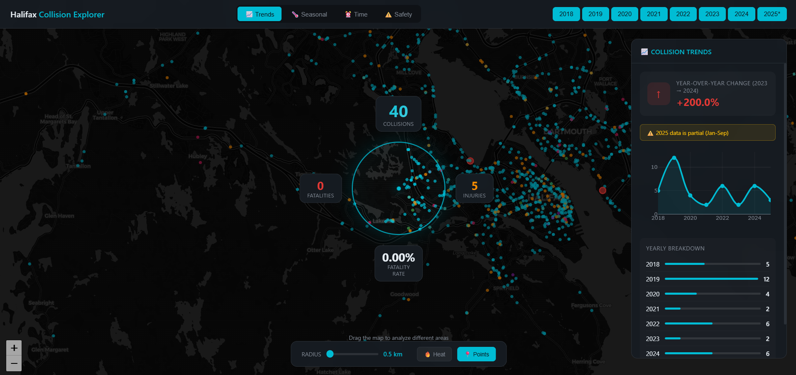

# Halifax Collision Explorer

An interactive map visualization exploring traffic collision patterns in Halifax, Nova Scotia (2018-2025). Move the map to dynamically analyze collision statistics within a customizable radius.



## ✨ Features

### 🎯 Interactive Analysis
- **Circular Analysis Region** - Drag the map to explore different areas
- **Dynamic Radius** - Adjust from 500m to 5km to change analysis scope
- **Real-time Stats** - See collision counts, injuries, and fatalities update instantly

### 📊 Story Modes
Switch between four analytical perspectives:

| Mode | Description |
|------|-------------|
| 📈 **Trends** | Year-over-year comparison with change indicators |
| 🌡️ **Seasonal** | Winter/Spring/Summer/Fall breakdown with monthly patterns |
| ⏰ **Time** | Hourly distribution, rush hour analysis, day-of-week patterns |
| ⚠️ **Safety** | Severity rates, pedestrian/cyclist incidents, weather conditions |

### 🗓️ Multi-Year Filtering
- Toggle individual years on/off
- Compare different time periods
- 2025 data marked as partial (Jan-Sep only)

### 🔥 Visualization Layers
- **Heatmap** - Density visualization of collision hotspots
- **Points** - Individual collision markers (sampled for performance)

## 🚀 Quick Start

1. Clone the repository:
```bash
git clone https://github.com/yourusername/halifax-collision-explorer.git
cd halifax-collision-explorer
```

2. Start a local server:
```bash
# Python 3
python -m http.server 8000

# Or use any static file server
npx serve
```

3. Open http://localhost:8000 in your browser

## 📁 Project Structure

```
├── index.html              # Main entry point
├── src/
│   ├── css/
│   │   └── styles.css      # All styling
│   ├── js/
│   │   └── app.js          # Application logic
│   └── data.json           # Processed collision data
├── Data/
│   └── Traffic_Collisions.csv  # Raw data source
└── build_data.py           # Data processing script
```

## 🛠️ Tech Stack

- **[Leaflet.js](https://leafletjs.com/)** - Interactive maps
- **[Leaflet.heat](https://github.com/Leaflet/Leaflet.heat)** - Heatmap visualization
- **[Plotly.js](https://plotly.com/javascript/)** - Charts and graphs
- **[CartoDB Dark Matter](https://carto.com/basemaps/)** - Map tiles

## 📊 Data Source

Traffic collision data from [Halifax Open Data](https://www.halifax.ca/home/open-data):
- **41,000+** collision records
- **2018-2025** time period
- Includes severity, weather, pedestrian/cyclist involvement, impaired driving indicators

## 🔄 Regenerating Data

If you need to update the data:

```bash
python build_data.py
```

This converts the CSV to an optimized JSON format with:
- Coordinate data
- Temporal fields (year, month, hour, day of week)
- Severity and condition flags

## 📝 License

MIT License - see [LICENSE](LICENSE) file

## 🙏 Acknowledgments

- Halifax Regional Municipality for collision data
- Inspired by radial demographic visualizations (https://visquill.com/)


